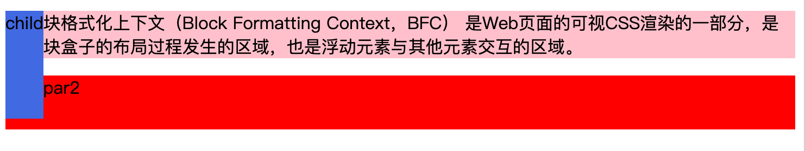
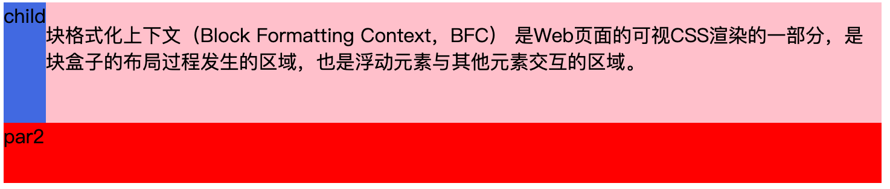
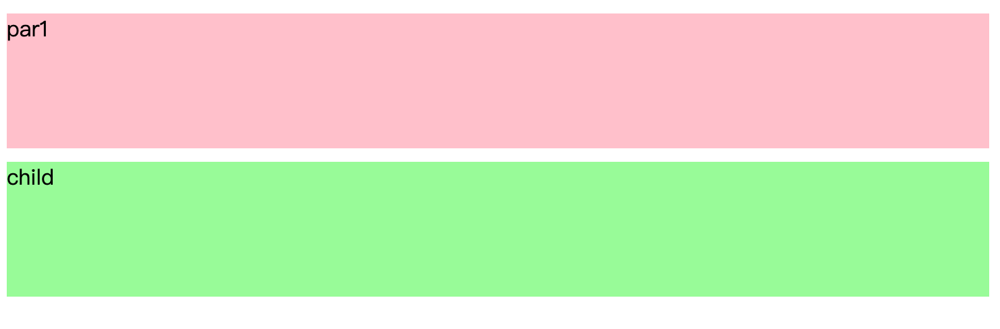
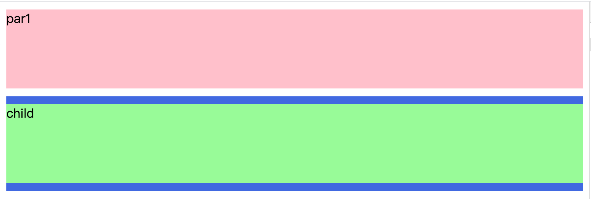
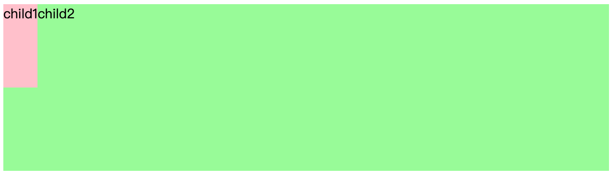
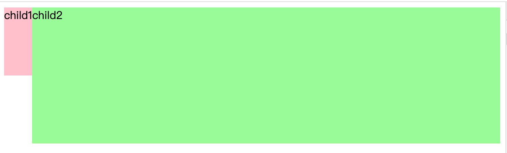

# BFC 介绍及其应用

## **定义**

`BFC (Block Formatting Context)` 是浏览器对某一块区域（也就是“盒子”）的渲染方式。

## **特性**

具有`BFC`特性的box容器具有普通元素没有的特性

- `BFC`是一个隔离的容器，内部子元素不会影响到外部（简单来说就是内部元素不会溢出）
- 属于同一个`BFC`的两个box的margin 会重叠 （外边距合并）
- 内部的块级box在垂直方向挨个排列
- 具备`BFC`区域不会和浮动的box重叠
- 计算`BFC`高度时，浮动元素也参与计算（解决父容器高度塌陷）

## **创建方式**

- 根元素(`<html>`)
- 浮动元素（`元素的 float 不是 none`）
- 绝对的定位（`position 为 absolute 或 fixed`）
- overflow 值不为 visible 的块元素
- display等于：`inline-block、table-cell、flex、grid`等
- display 值为 `flow-root` 的元素 （无副作用）

## **应用**

**场景1：清除浮动**

```html
<style>
    .par1 {
        background: pink;
        /* BFC */
        /* display: flow-root;  */
    }

    .par2{
        background: red;
        height: 50px;
    }
    .child{
        float: left;
        height: 100px;
        background: royalblue;
    }
</style>

<body>
    <div class="par1">
        <div class="child">child</div>
        <p>
            块格式化上下文（Block Formatting Context，BFC） 是Web页面的可视CSS渲染的一部分，是块盒子的布局过程发生的区域，也是浮动元素与其他元素交互的区域。
        </p>
    </div>
    <div class="par2">par2</div>
</body>
```

效果：

如下 child box 超出了 "par"  box 的高度



加上 `BFC` 属性 `display: flow-root;`

```html
...
.par1 {
    background: pink;
    /* BFC */
    display: flow-root;
}
...
```



"par"  box 的高度被撑开了

以上例子说明了`BFC`的2个属性

1. **BFC是一个隔离的容器，内部子元素不会影响到外部**
2. **计算BFC高度时，浮动元素也参与计算**

**场景2：**外边距合并

```html
<style>
    .par1, .child{
        height: 100px;
        margin: 10px 0;
    }
    .par1{
        background: pink;
    }
    .par2{
        background: royalblue;
        /* BFC */
        /* display: flow-root; */
    }

    .child{
        height: 100px;
        background:palegreen;
    }
</style>
<body>
    <div class="par1"> par1</div>
    <div class="par2">
        <div class="child">child</div>
    </div>
</body>
```

效果：

外边距合并了



**BFC属性：属于同一个`BFC`的两个box的margin 会重叠**

```html
...
.par2{
    background: royalblue;
    /* BFC */
    display: flow-root;
}
...
```



把`par2` 加上`BFC`属性 创建另外一个`BFC` 解决了margin 重叠问题

**场景3：**具备BFC区域不会和浮动的box重叠

```html
<style>
    .child1{
        float: left;
        height: 100px;
        background:pink;
    }
    .child2{
        /* BFC */
        /* display: flow-root; */
        height: 200px;
        background:palegreen;
    }
</style>
<body>
    <div class="par">
        <div class="child1">child1</div>
        <div class="child2">child2</div>
    </div>
</body>
```

效果：

可以看到如下 `child1` 是一个浮动元素 和child2重叠了



`child2` 加上 `BFC` 特性

```html
.child2{
    /* BFC */
    display: flow-root;
    height: 200px;
    background:palegreen;
}
```



浮动元素和`BFC`区域不会重叠